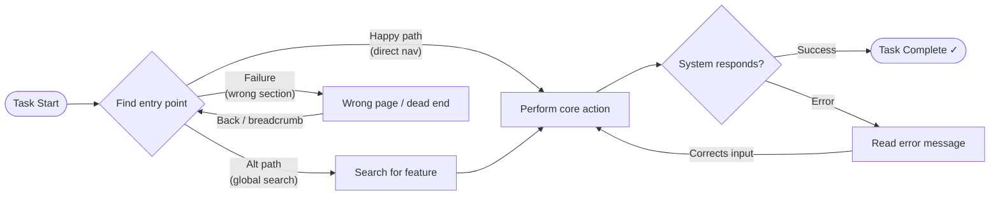

# User Journey Map & Emotional Journey Reference

## Purpose

A user journey map documents:

1. The **paths** a user can take to complete a task (happy path, alternatives, failure/recovery paths)
2. The **emotional states** they experience at each step — both predicted (planning phase) and observed (analysis phase)

Journey maps produced by this skill are task-scoped: one map per usability test task, grounded in the specific scenarios and findings rather than high-level personas.

---

## Journey Map Structure

### Task phases (X-axis)

| Phase                      | Description                                     |
| -------------------------- | ----------------------------------------------- |
| **Trigger**                | What prompts the user to start the task         |
| **Navigation / Discovery** | Finding the correct area of the UI              |
| **Interaction**            | Performing the core action                      |
| **Validation / Feedback**  | Receiving confirmation or encountering an error |
| **Completion**             | Reaching the defined success state              |

Not every task will have all five phases. Add or remove phases to match the task scope.

### Journey rows

| Row                 | Description                                        |
| ------------------- | -------------------------------------------------- |
| **User action**     | What the user does at each step                    |
| **Touchpoints**     | The UI element, page, or component involved        |
| **Decision points** | Moments where the path can branch                  |
| **Emotion score**   | The user's emotional state at each step (-2 to +2) |

---

## Path Types

### 1. Happy Path (Primary Path)

The most direct, intended route from task trigger to successful completion — no errors, no detours. This is the baseline for all other paths.

### 2. Alternative Path(s)

Legitimate alternative routes that still lead to task success. Users may discover these through exploration, habit, or system affordances (e.g., search vs. navigation menu). Include up to **2 alternative paths** per task.

### 3. Failure / Recovery Path

A path where the user encounters an obstacle — an error message, wrong page, or dead end — and must recover. Document:

- The **point of failure** — which step or decision triggered the problem
- The **recovery action** — what the user does next (back button, re-read instructions, etc.)
- **Recovery success** — whether the participant eventually completed the task

---

## Mermaid Flowchart Format

Render journey paths as a Mermaid `flowchart LR` diagram. Include all paths in a single diagram.



### Styling conventions

- `([...])` — rounded rectangles for start and end states
- `{...}` — diamonds for decision points and branches
- `[...]` — regular rectangles for steps, actions, and intermediate states
- Label every edge with the path type or user action
- Use `%%` comments to annotate emotion scores at key steps:
  ```
  %% Emotion at NavDecision: +1 (familiar navigation)
  %% Emotion at ErrorState: -2 (no actionable error message)
  ```
- If a flow has more than 4 branches, split into sub-diagrams (one per path type) rather than producing one unreadable chart

---

## Emotional Journey Curve

The emotional curve is a line chart that plots the user's emotional state at each key step of the task.

### Emotion scale

| Score | State             | Typical indicators                                               |
| ----- | ----------------- | ---------------------------------------------------------------- |
| +2    | **Delighted**     | User explicitly expresses pleasure; task feels effortless        |
| +1    | **Satisfied**     | Smooth progress, no friction, minor positive cues                |
| 0     | **Neutral**       | Neither positive nor negative; routine interaction               |
| -1    | **Frustrated**    | Confusion, unexpected delay, minor error                         |
| -2    | **Stuck / Angry** | Task blocked; user expresses strong negative emotion or abandons |

### Assigning scores — Planning Phase (Mode A)

When producing a predicted emotional journey during test planning:

- Use UX heuristics (especially Nielsen H1 Visibility, H6 Recognition, H9 Error recovery) to predict friction points
- Assign **0 (Neutral)** as the default for routine, well-understood interactions
- Assign **-1** for any step that requires the user to recall information, interpret jargon, or recover from a common error
- Assign **-2** only where the product is known to have a significant failure (e.g., an error message with no recovery guidance)
- Assign **+1 / +2** where the flow has a clear affordance, satisfying confirmation, or delightful interaction

Label each score as **Predicted** in the output.

### Assigning scores — Analysis Phase (Mode B)

When plotting an observed emotional journey from session data:

- **Think-aloud quotes** — explicit emotional statements take priority (e.g., "I have no idea what I did wrong" → -2)
- **Behavioural indicators** — hesitation, repeated attempts, refreshing, or asking for help → -1 or -2
- **Post-task SEQ scores** — if Single Ease Question (1–7 scale) data is available, map to emotion scores: ≤2 → -2, 3 → -1, 4 → 0, 5 → +1, ≥6 → +2
- Where multiple participants experienced the same step, use the **median score**
- Label each score with its source (quote, observer note, SEQ)

Label each score as **Observed** in the output.

---

## Inline SVG Emotional Curve for HTML Reports

In the Density-styled HTML report, render the emotional journey as an inline SVG using the following structure. The Y-axis maps emotion scores (+2 at top, -2 at bottom). The X-axis lists the key task steps.

```html
<!-- Example: 5-step emotional journey (predicted) -->
<svg
  viewBox="0 0 560 180"
  xmlns="http://www.w3.org/2000/svg"
  role="img"
  aria-label="Predicted emotional journey curve for Task 1"
>
  <!-- Y-axis labels -->
  <text x="8" y="28" font-size="11" fill="#666">+2</text>
  <text x="8" y="68" font-size="11" fill="#666">+1</text>
  <text x="8" y="108" font-size="11" fill="#666">0</text>
  <text x="8" y="148" font-size="11" fill="#666">-1</text>
  <text x="8" y="168" font-size="11" fill="#666">-2</text>

  <!-- Horizontal grid lines -->
  <line
    x1="40"
    y1="25"
    x2="540"
    y2="25"
    stroke="#e0e0e0"
    stroke-dasharray="4,3"
  />
  <line
    x1="40"
    y1="65"
    x2="540"
    y2="65"
    stroke="#e0e0e0"
    stroke-dasharray="4,3"
  />
  <line
    x1="40"
    y1="105"
    x2="540"
    y2="105"
    stroke="#e0e0e0"
    stroke-width="1.5"
    stroke-dasharray="4,3"
  />
  <line
    x1="40"
    y1="145"
    x2="540"
    y2="145"
    stroke="#e0e0e0"
    stroke-dasharray="4,3"
  />
  <line
    x1="40"
    y1="165"
    x2="540"
    y2="165"
    stroke="#e0e0e0"
    stroke-dasharray="4,3"
  />

  <!-- Emotion curve (happy path) — blue #0066cc -->
  <!-- Points: x = 90+(step*110), y = 105 - (score * 40) -->
  <polyline
    points="90,65 200,65 310,145 420,165 530,65"
    fill="none"
    stroke="#0066cc"
    stroke-width="2.5"
    stroke-linejoin="round"
  />

  <!-- Data point circles -->
  <circle cx="90" cy="65" r="5" fill="#0066cc" />
  <circle cx="200" cy="65" r="5" fill="#0066cc" />
  <circle cx="310" cy="145" r="5" fill="#0066cc" />
  <circle cx="420" cy="165" r="5" fill="#0066cc" />
  <circle cx="530" cy="65" r="5" fill="#0066cc" />

  <!-- X-axis step labels -->
  <text x="90" y="178" font-size="10" text-anchor="middle" fill="#444">
    Trigger
  </text>
  <text x="200" y="178" font-size="10" text-anchor="middle" fill="#444">
    Discovery
  </text>
  <text x="310" y="178" font-size="10" text-anchor="middle" fill="#444">
    Interaction
  </text>
  <text x="420" y="178" font-size="10" text-anchor="middle" fill="#444">
    Validation
  </text>
  <text x="530" y="178" font-size="10" text-anchor="middle" fill="#444">
    Completion
  </text>
</svg>
```

### Y-axis coordinate mapping

To convert an emotion score to a Y pixel position (in a 180px-high SVG with top padding 20px):

```
y = 105 - (score × 40)
```

| Score | Y position                      |
| ----- | ------------------------------- |
| +2    | 25                              |
| +1    | 65                              |
| 0     | 105                             |
| -1    | 145                             |
| -2    | 165 (clamped to avoid clipping) |

### Multi-path emotion overlays

When comparing the happy path vs an alternative vs a failure/recovery path, use separate `<polyline>` elements:

| Path type          | Stroke colour | Legend label |
| ------------------ | ------------- | ------------ |
| Happy path         | `#0066cc`     | Primary path |
| Alternative path   | `#ff8c00`     | Alt path     |
| Failure / recovery | `#cc0000`     | Failure path |

Add a `<legend>` block below the SVG in plain HTML listing each colour and its path label. Use both colour and a dashed/solid stroke style to ensure the chart remains accessible without relying on colour alone:

- Happy path: solid line
- Alternative path: `stroke-dasharray="8,4"`
- Failure / recovery: `stroke-dasharray="3,3"`

---

## Output Format in Reports

In the HTML findings report, include the following for each task:

```
## Task [N] — [Task Name]

### Journey Paths
[Mermaid flowchart — all paths]

### Emotional Journey
[Inline SVG curve — labelled Predicted or Observed]

### Key Journey Observations
- **Step with sharpest emotion drop**: [step name] (score: −X)
- **Root cause**: [brief explanation linked to a finding]
- **Happy path completion rate**: X / N participants
- **Alternative path usage**: X / N participants used [path name]
- **Recovery success rate**: X / N participants recovered after failure at [step]
```

---

## Best Practices

- Keep the journey map **task-scoped** — one map per task, not one map for the entire product
- Base planning-phase emotion scores on **heuristic predictions**, not assumptions of a flawless experience
- In the analysis phase, always **cite the source** of emotion data (quote, observer note, SEQ score)
- If multiple tasks share the same sub-flow (e.g., login), produce a shared journey segment and reference it in each task map
- Do **not fabricate** participant quotes or observations — use only data provided by the user
- A journey map with only a happy path is incomplete — always document at least one failure or alternative path
